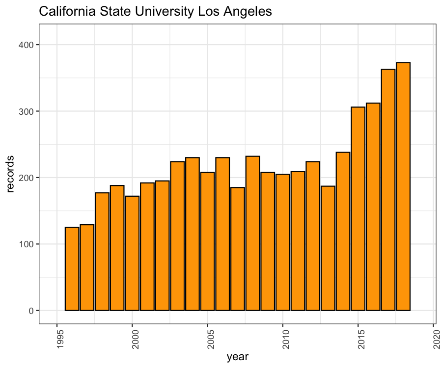

# Publication Records

## Data Collection

Mostly from Web of Science, use `ZP=xxxxx` as search and then `analyze` by `Publication Years` and `Download` `All data rows`. 

## Publications from Long Beach

Yearly distribution of WoS publications from CSU Long Beach

The same statistics for CSU Los Angeles

The same statistics for CSU Northridge

The same statistics for CSU Fullerton

The same statistics for UC Irvine

The same statistics for UC Santa Barbara

