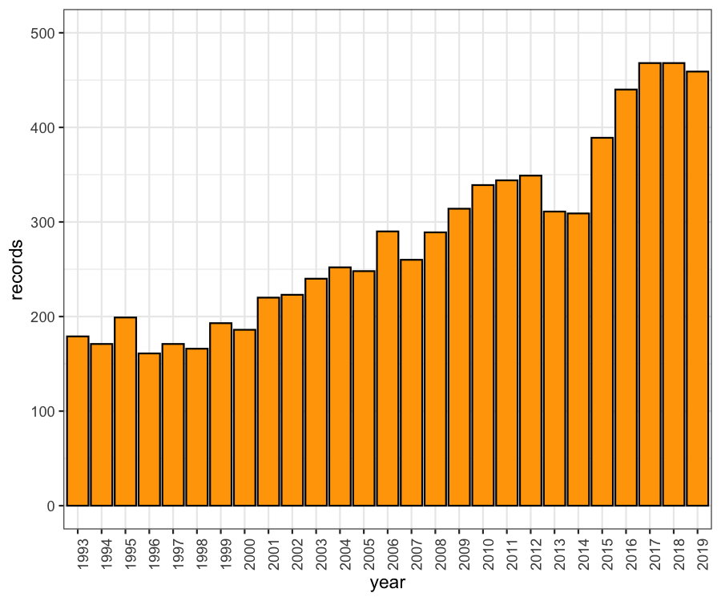
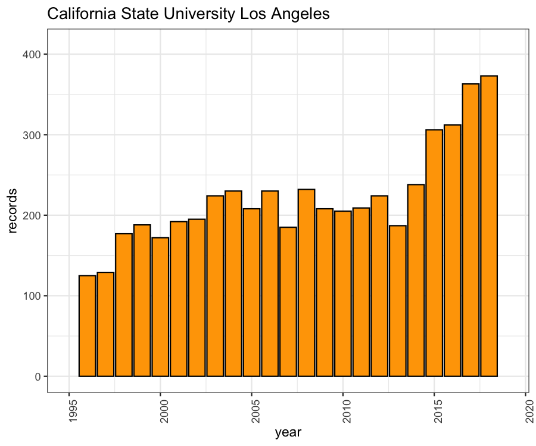
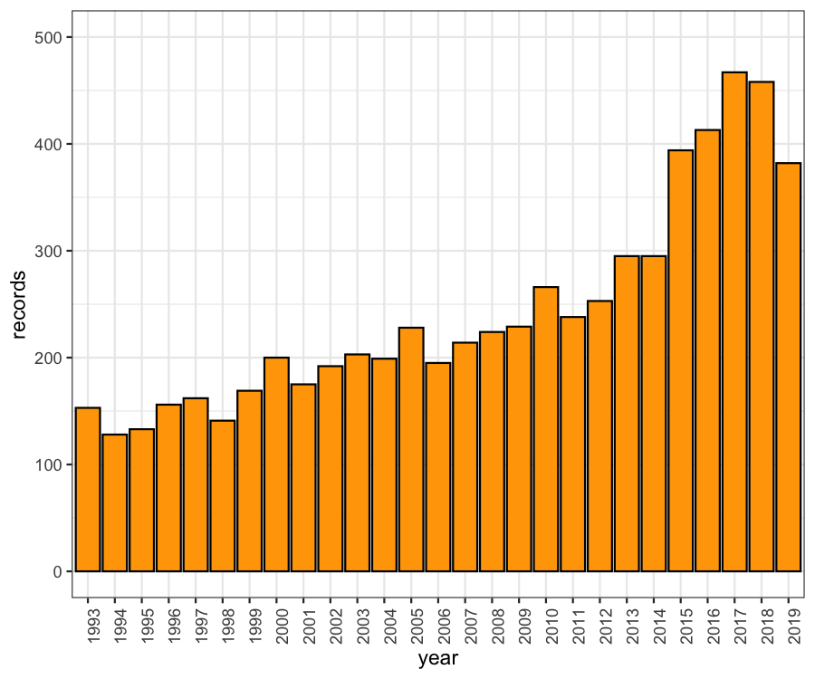
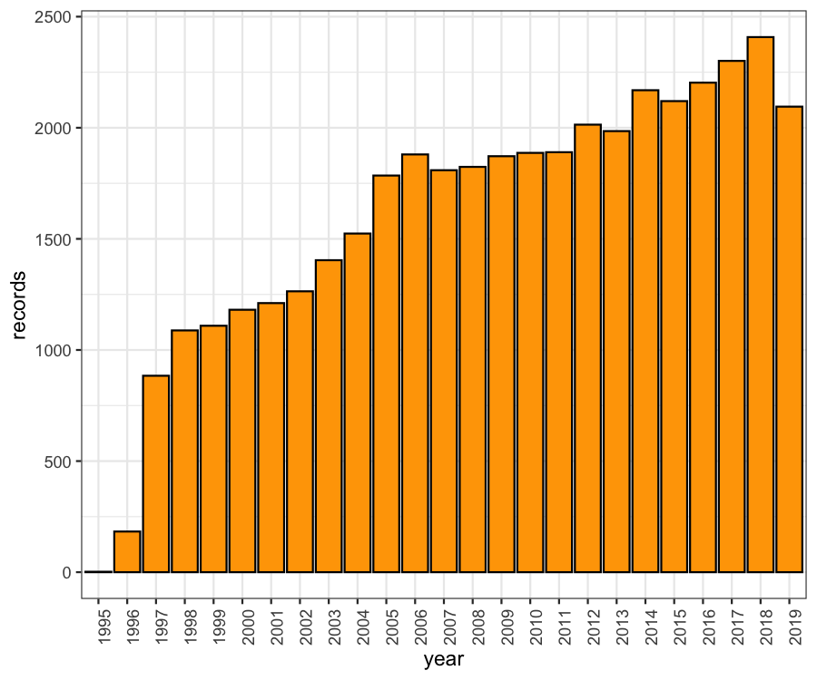

# Stats
 Statistics on (mostly) peer-reviewed publications according to Web of Science

## Publications from Long Beach

Yearly distribution of WoS publications from CSU Long Beach

The same statistics for CSU Los Angeles

The same statistics for CSU Northridge

The same statistics for UC Irvine

## TT/TF Faculty

See [Faculty at University](data/university-faculty.csv)

## State Expenditures

See [State Expenditure Data](https://www.census.gov/data/datasets/2017/econ/local/public-use-datasets.html)

## Resources:

[CSU Faculty](http://www.fullerton.edu/data/_resources/pdfs/ir/CSU_TenDen_SFR_Trends_2009-18.pdf)
